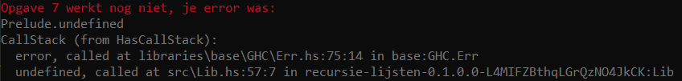

# Recursie en Lijsten

Welkom bij het eerste practicum voor DEP. Hierin gaan we oefenen met een aantal basisprincipes. Doorloop de volgende stappen voordat je met dit practicum begint:

- Installeer de Haskell Tool Stack, ook wel bekend als Stack. Gebruik hierbij de methode zoals beschreven in [de Stackhandleiding](STACK.md).
- Voer in deze map het commando `stack run` uit. Dit kan heel lang duren; wacht totdat het proces klaar is met draaien!
- Check of je onderaan de uitvoer van het vorige commando de volgende tekst ziet:



Zie je deze tekst? Dan ben je er klaar voor om aan het practicum te beginnen! Zie je iets heel anders? Check dan of de sectie "Bekend probleem: handmatig uitpakken van tools" in [de Stackhandleiding](STACK.md) op jou van toepassing is. Zo niet, neem dan contact op met je docent/studentassistent.

De volgende software is optioneel, maar kan je helpen bij het ontwikkelen:

- We volgen de specificatie van [Haddock](https://haskell-haddock.readthedocs.io/en/latest/intro.html) voor de documentatie van jullie code. Je kunt de package zelf installeren als je je documentatie ook wilt omzetten naar een HTML-pagina, maar wij kijken alleen naar de comments in de code zelf;
- [HLint](https://hackage.haskell.org/package/hlint) geeft suggesties om je code te verbeteren. Gebruik deze alleen bij Practicum 2 tot en met 4;
- [GHCID](https://github.com/ndmitchell/ghcid) is een GHCI daemon, die je code compileert bij iedere save.

## Werken met/aan de practica

Door `stack run` aan te roepen voer je het hoofdprogramma uit, hetgeen ook (vaak achter een keuzemenu) testcode bevat. **Bijna** alle opdrachten, behalve bijv. opdrachten waarbij je alleen documentatie moet schrijven, worden hierdoor getest tegen door ons geschreven cases. De feedback krijg je in leesbaar formaat in je console te zien. Wel zal die de eerste keer overwegend rood zijn; schrik daar niet van.

Voor alle practica vragen we jullie om de functies in de `src`-map van het project af te maken. Zoals je in de afbeelding hierboven ziet, zijn een aantal functies nog `undefined`. Jullie doel is dan ook alle `undefined`s uit de code te halen, en te vervangen met de juiste oplossing.
De aanpassingen die we van jullie vragen staan aangegeven met het woord TODO, in commentaar boven elke functie.

Als je in `src/Lib.hs` kijkt, zie je bij de eerste opdracht:

```haskell
-- TODO: Schrijf en documenteer de functie ex1, die de som van een lijst getallen berekent.
-- Voorbeeld: ex1 [3,1,4,1,5] ~> 14
ex1 :: [Int] -> Int
ex1 = undefined
```

Om deze opdracht te maken, moet je de volgende twee dingen doen:
1. Vervang de regel `ex1 = undefined` door een werkende definitie van `ex1`, in zoveel regels als je nodig hebt. **Let op: hoewel dit heel makkelijk te doen is met standaardfuncties en/of hogere-orde functies, is het niet de bedoeling om die in dit practicum te gebruiken. Bij alle volgende practica mag je deze wel gebruiken.**
2. Voeg je eigen commentaar toe in Haddockstijl, dat beschrijft wat de functie doet en hoe het dat doet. Zie voor aanvullende uitleg [de Haddockhandleiding](HADDOCK.md).

# Fouten oplossen in Haskell

Als je aan het werk gaat met Haskell, en je hebt je functie niet in één keer goed (valt te verwachten), krijg je te maken met errors van de compiler. Haskell is sterk getypeerd, en vindt het niet grappig als je bijvoorbeeld een `Int` geeft waar een `Bool` had moeten staan. Tijdens het compileren doet Haskell een typecheck, en als deze faalt krijg je een type-error. 

Het oplossen hiervan is een substantieel deel van Haskell-programmeren, maar zodra je programma vrij van deze errors is, zal 90% ook altijd werken. Haskell is heel streng tijdens het compilen, waardoor tijdens de uitvoering fouten een stuk zeldzamer zijn. Natuurlijk bestaat dit soort fouten nog steeds (`undefined`, delen door 0, items uit een te korte lijst proberen te halen, etc.), maar deze zijn een stuk zeldzamer. Het leren lezen van type-errors kost aanvankelijk wat tijd, maar gaandeweg zal je hier aan wennen en zul je merken dat de compiler meer bezig is met meedenken dan met bestraffen.
 
Per functie ga je dus wat fouten op moeten lossen, waarschijnlijk in deze volgorde (maar niet altijd elke stap):

1. `undefined` (rood), dit is de code waar je nog niet aan toe bent gekomen;
2. Type errors (je code compileert niet);
3. Exceptions (rood), anders dan de `undefined` waar je mee begint (je code bevat fouten);
4. Foute antwoorden (geel), je code werkt, maar geeft volgens de testcode niet het verwachte antwoord;
5. Positieve feedback van de testcode (groen).

Let op: de testcode geeft een indicatie van het resultaat, maar is geen garantie! Code kan nog steeds incorrect zijn, maar toevallig door de tests heen komen, ook al is die kans klein. Daarom kijken we jullie code gewoon handmatig na voor de becijfering. Daarnaast is de programmeerstijl een groot onderdeel van de beoordeling. Meer over goede stijl leer je gedurende het vak.

Als alle oefeningen op groen staan: Lekker bezig! Je kunt je werk inleveren, waarna je van ons (docenten / studentassistent) feedback krijgt op je code. Natuurlijk helpen we je ook graag als je voor die tijd vast komt te zitten.

Heel veel succes en plezier met Haskell!
