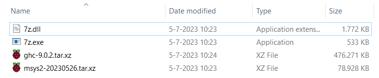
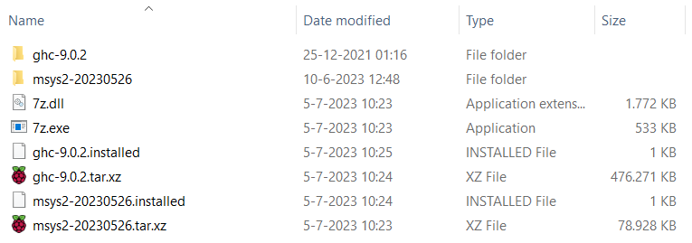

# Installatie en gebruik van de Haskell Tool Stack

Voor de practica van Declarative Programming leren we te programmeren in de taal Haskell. Om de code, inclusief de testsuites, te kunnen compileren en uitvoeren, maken we gebruik van de Haskell Tool Stack (vanaf dit punt: Stack). In dit document gaan we in meer detail in op hoe je Stack kunt installeren, wat je er allemaal mee kunt, welke errors onder ons bekend zijn en hoe je die kunt verhelpen.

## Installatiemethode

Er zijn meerdere pakketten beschikbaar die Stack op je systeem installeren. Elk van deze pakketten zou ervoor moeten zorgen dat je Stack-commando's kunt uitvoeren in je console. Om te checken dat het is gelukt, kun je `stack --version` uitvoeren in je console:

```
> stack --version
Version 2.11.1, Git revision c1167a6abc3f4978ccded5ba0246a57387da0e2f x86_64 hpack-0.35.2
```

Uiteraard hoeft dit niet exact dezelfde versie te zijn als hierboven, dit is slechts een voorbeeld.

### Aanbevolen methode: Stack direct installeren

We adviseren jullie om Stack direct van de homepage van Stack zelf te halen ([link](https://docs.haskellstack.org/en/stable/)). Voor Linux-systemen en het overgrote merendeel van de Macs kun je het curl-commando uitvoeren dat wordt gegeven (aangenomen dat je curl hebt geïnstalleerd; zo niet, dan kun je dat waarschijnlijk met `sudo apt install curl` verhelpen). Voor Windows-systemen kun je de installer binnenhalen en uitvoeren; mocht dat niet lukken, dan kun je ook de executable zelf downloaden en handmatig aan je PATH toevoegen.

### Afgeraden methode: Installeren via GHCup

De primaire installer voor allerlei Haskellsoftware, genaamd GHCup ([link](https://www.haskell.org/ghcup/)), is ook in staat om Stack te installeren. Toch raden we dit af, om de volgende redenen:

- In het installatiescript van GHCup voor Windows moet je expliciet onthouden om Stack te installeren, want de default voor die keuze is om dat niet te doen;
- In onze ervaring moet het installatiescript van GHCup op Windows meermalen gedraaid worden voordat het ook echt werkt;
- GHCup haalt automatisch versies van de benodigde tools GHC en Cabal binnen, maar Stack haalt *ook zijn eigen versies van dezelfde tools binnen*. Zodoende heb je dus altijd meerdere kopieën van de tools op je systeem; als er errors optreden, kan het zijn dat je de verkeerde versie probeert te repareren.

Mocht je toch GHCup gebruiken, dan kan het prima zijn dat je het verschil nooit merkt; echter, als je tegen problemen aanloopt, houd dan in gedachten dat de tools die in GHCup staan *niet dezelfde tools zijn die Stack gebruikt*.

### Verouderde methode: Installeren via Haskell Platform

Voor 2022 maakte dit vak gebruik van Haskell Platform ([link](https://www.haskell.org/platform/)) om Stack te installeren. Echter, dit platform is inmiddels helaas verouderd en wordt niet meer onderhouden. Mocht je Stack indertijd geïnstalleerd hebben via Haskell Platform, bijvoorbeeld tijdens een eerdere iteratie van dit vak, dan kun je Stack gewoon blijven gebruiken, maar raden we je aan om deze even te updaten, met het commando `stack upgrade` in je console.

## Projecten uitvoeren: `stack run`

De voornaamste manier waarop je Stack gaat gebruiken tijdens de practica is voor het uitvoeren van je code. Elk practicumproject bevat testcode en aanvullende functies, vaak met een keuzemenu, die je geregeld tijdens het programmeren wilt draaien. Hiervoor navigeer je in een consolescherm naar de projectmap (bijv. `1-recursion-and-lists`) en geef je het commando:

```
stack run
```

Stack houdt bij of er iets is veranderd in je code sinds de laatste keer dat je het project gerund hebt; zo ja, dan voert Stack ook een build-commando uit, waarin het je code compileert naar nieuwe executables. Dit commando kun je ook expliciet geven voor het runnen, maar het werkt precies hetzelfde:

```
stack build
stack run
```

De eerste keer dat een project moet worden gebuild duurt altijd heel lang, en het duurt nóg langer als je nog nooit eerder `stack run` op je systeem hebt uitgevoerd. Dit komt doordat Stack de noodzakelijke tools aan het downloaden is. Je kunt dan een hele tijd tekst in je console zien die begint met:

```
Downloaded msys2-20230526.
Downloaded 7z.dll.
Downloaded 7z.exe.
Decompressing msys2-20230526.tar.xz...

7-Zip 22.01 (x64) : Copyright (c) 1999-2022 Igor Pavlov : 2022-07-15

Scanning the drive for archives:
1 file, 80821956 bytes (78 MiB)

Extracting archive: C:\Users\nick.roumimper\AppData\Local\Programs\stack\x86_64-windows\msys2-20230526.tar.xz
--
Path = C:\Users\nick.roumimper\AppData\Local\Programs\stack\x86_64-windows\msys2-20230526.tar.xz
Type = xz
Physical Size = 80821956
Method = LZMA2:24 CRC32
Streams = 1
Blocks = 5
Cluster Size = 67108864
Characteristics = BlockPackSize BlockUnpackSize

Everything is Ok
```

...etcetera, etcetera. Als het proces nog bezig is, laat het dan maar gewoon draaien! Bij het eerste practicum krijg je uiteindelijk feedback te zien zoals in de afbeelding hieronder. Toekomstige runs gaan een stuk sneller.

### Bekend probleem: kleuren in de Windows-console

Gebruik PowerShell in plaats van Command Prompt.


### Bekend probleem: handmatig uitpakken van tools

Op sommige systemen worden de noodzakelijke tools wel gedownload, maar niet uitgepakt. Daar loopt dan ook je `stack run`-commando vast. Waarschijnlijk is dit een kwestie van rechten op je systeem, maar de makkelijkste manier om dit op te lossen is door ze handmatig uit te pakken. Je vindt waar Stack de tools opslaat met het volgende commando in je console:

```
stack path --programs
```

Waarschijnlijk zie je in deze map een paar bestanden zoals hieronder:



Hier zijn de `*.tar.xz`-bestanden (ook wel tarballs genoemd) belangrijk. Dit zijn tweemaal ingepakte archieven die je kunt uitpakken met een tool zoals 7Zip. Voor elk van deze tarballs (bijv. `ghc-9.0.2.tar.xz`) moet je de volgende stappen zetten:

1. Pak de tarball uit, en pak het bestand uit dat daar in zat, zodat er een map uit komt (bijv. `ghc-9.0.2`);
2. Maak een tekstbestand aan, met dezelfde naam en de extensie `.installed`, en alleen het woord `installed` op de eerste regel (bijv. `ghc-9.0.2.installed`).

Aan het einde van dit proces ziet je map er bijvoorbeeld zoals hieronder uit:



Nu zou je `stack run`-commando wel moeten werken. Let op: helaas moet je dit elke keer doen dat er een nieuwe versie van GHC wordt gedownload!

## Projecten opschonen: `stack purge`

Als je eenmaal `stack run` werkend hebt gekregen binnen een project, heeft Stack je code gecompileerd (vertaald naar een uitvoerbaar bestand) en uitgevoerd. Die executables, en alle noodzakelijke tussenproducten, zitten binnen elk project in de verborgen `.stack-work`-map. Het biedt geen meerwaarde om hierin te gaan neuzen; dat laten we aan Stack.

Echter, soms gaat er iets mis bij het compileren van je code, en blijft Stack vastzitten op een verouderde versie, waardoor je niet verder kunt. Dit is zeer zeldzaam, maar mocht dit voorkomen, dan kun je Stack dwingen om te verversen door de hele `.stack-work`-map weg te gooien. Dat kan handmatig, maar ook met het commando:

```
stack purge
```

Je gooit hiermee dus niet jouw code weg! Die blijft in de bronmappen staan.

## Projecten zelf testen: `stack ghci`

Als je je functies zelf handmatig wilt testen, kan dat ook! De Glasgow Haskell Compiler (GHC) is de tool die Stack gebruikt om je code te compileren. Deze compiler heeft ook een tool in zich waarmee je interactief je code kunt inladen en commando's kunt geven. Dit noemen we "GHC interactief", of afgekort, GHCi.

Als je het commando `stack ghci` uitvoert in een projectmap (bijv. `1-recursion-and-lists`), laadt GHCi je code voor je in. Je ziet dan iets zoals hieronder in je console:

```
GHCi, version 9.0.2: https://www.haskell.org/ghc/  :? for help
[1 of 3] Compiling Lib              ( C:\Users\nick.roumimper\OneDrive - Stichting Hogeschool Utrecht\Documents\- 2023-2024 - DEP\dep-git\1-recursion-and-lists\src\Lib.hs, interpreted )
[2 of 3] Compiling Main             ( C:\Users\nick.roumimper\OneDrive - Stichting Hogeschool Utrecht\Documents\- 2023-2024 - DEP\dep-git\1-recursion-and-lists\app\Main.hs, interpreted )
[3 of 3] Compiling Paths_recursie_lijsten ( C:\Users\nick.roumimper\OneDrive - Stichting Hogeschool Utrecht\Documents\- 2023-2024 - DEP\dep-git\1-recursion-and-lists\.stack-work\dist\d53b6a14\build\autogen\Paths_recursie_lijsten.hs, interpreted )
Ok, three modules loaded.
Loaded GHCi configuration from C:\Users\nick.roumimper\AppData\Local\stack\ghci-script\60b58c14\ghci-script
ghci>
```

Achter `ghci> ` staat je cursor, en kun je dus commando's gaan geven, net als in omgevingen zoals de Python IDLE. Een heel eenvoudig voorbeeld:

```
ghci> 2+4
6
ghci>
```

Je kunt dus ook functies en waarden uit het practicum zelf aanroepen. Wat heel erg kan helpen bij de practica is om aan GHCi te vragen welk type een gegeven expressie heeft. Zo heb je deze functie uit het eerste practicum:

```
ghci> :t ex1
ex1 :: [Int] -> Int
ghci>
```

Dit zie je ook in de type signature van `ex1` zo staan. Maar Haskell kan ook het type van elke geldige uitdrukking deduceren! Neem het onderstaande voorbeeld:

```
ghci> :t ex1 [1,2,3]
ex1 [1,2,3] :: Int
ghci>
```

De volgende GHCi-commando's zijn belangrijk om te kennen:
 - `:r`    herlaadt alle ingeladen bestanden
 - `:l`    laadt een bestand in (heb je met `stack ghci` niet vaak nodig)
 - `:t`    vraag het type op van een functie of constante (heel handig bij het debuggen!)
 - `:q`    quit, kan ook met CTRL-D

We raden jullie van harte aan om zelf te gaan experimenteren met GHCi! Twee kleine extra voetnoten:

1. Als je `stack ghci` uitvoert buiten een projectmap, krijg je ook een werkende GHCi-omgeving, maar zonder ingeladen bestanden. Dat kan handig zijn voor oefeningen tijdens de les;
2. Niet alles wat werkt in GHCi werkt ook binnen een Stackproject. Die gevallen zijn zeer zeldzaam, en de uitleg kost nodeloos veel tijd, maar vertrouw dus op de testcode in het project in plaats van wat je zelf uitvoert in GHCi!

## Code verbeteren: `hlint`

Zoals bij veel talen heeft ook Haskell pakketten om automatisch hints te geven ter verbetering van je code. Het meest gebruikte pakket voor Haskell is HLint. Wees je ervan bewust dat de docenten zelf geen HLint gebruiken, en je dus ook niet kunnen helpen bij het gebruik ervan. Ook kun je HLint alleen gebruiken bij Practicum 2 tot en met 4! Bij Practicum 1 geeft HLint goede tips, maar we willen dat jullie daar nog geen hogere-orde functies gebruiken. Je kunt bij Practicum 1 dus juist een lager cijfer krijgen door HLint te gebruiken.

Een eenvoudige methode om HLint te installeren is met behulp van Stack. Voer hiervoor het volgende commando uit:

```
stack install hlint
```

Ook deze installatie duurt erg lang, langer nog dan die voor Stackprojecten. Geef het gewoon de tijd. Als het proces klaar is, kun je een waarschuwing zoals hieronder onderaan de uitvoer zien:

```
Warning: Installation path C:\Users\nick.roumimper\AppData\Roaming\local\bin not found on the PATH environment variable.
```

Dit betekent dat het commando `hlint` nog niet gaat werken in je console, ondanks dat je de executable wel al klaar hebt staan. De volgende stap spreekt voor zich: neem het pad uit je console over en voeg het toe aan je PATH-omgevingsvariabele! Herstart daarna je console, anders is je PATH nog niet geüpdatet.

Nu kun je HLint aanroepen om hints te krijgen; gebruik daarvoor `hlint <pad/naar/jouw/code>`. Dit werkt alleen als je al iets hebt ingevuld; HLint kijkt over `undefined` functies heen. In de map `2-cellular-automata` krijg je bijvoorbeeld de volgende uitvoer:

```
>hlint src
src\Lib.hs:(161,12)-(164,16): Suggestion: Use &&
Found:
  and
    [foldFocusList (+) intVoorbeeld == 15,
     foldFocusList (-) intVoorbeeld == 7,
     foldFocusList (++) stringVoorbeeld == "012345"]
Perhaps:
  (foldFocusList (+) intVoorbeeld == 15)
    &&
      (foldFocusList (-) intVoorbeeld == 7)
        && (foldFocusList (++) stringVoorbeeld == "012345")

1 hint
```

Met andere woorden, volgens HLint is het efficiënter om `(&&)` te gebruiken in plaats van `and`. Een prima tip, maar de werking van de code verandert er niet door. Dat is het soort tips dat HLint geeft. Zorg ervoor dat je altijd begrijpt wat HLint voorstelt voordat je het zelf doorvoert; tijdens het assessment gaan we je vragen stellen over je functies, en "HLint zei dat het zo moest" is geen excuus om niet te begrijpen wat er staat!
